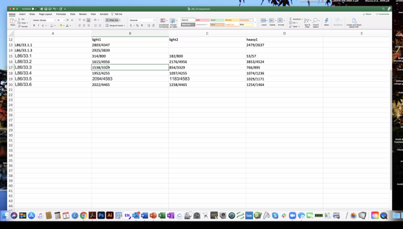

# NeuroMabSeq Website

## DJANGO + NGINX + GUNICORN  see the tutorial for setup below.

### TODO:
- csv limit as well ?
- clean up the entry view..
- 101.1 101.2 etc if repeats..
- fix the duplicates in the blat search
- aa file download
- help with sams example (aberrant chain 6-7 in one?)
- auto create settings with hidden recaptcha as part of ./restart.sh
- fix html table for blat and duplicate entries
- turn of debug, any other steps to check for proper deployment settings
- auto detect query
- work with the addgene metadata 
- how to backup sql lite database
- debug=FALSE, turn of debug, any other steps to check for proper deployment settings
- upload the whole plate? Pull duplicates first?
- worth quantifying RNA, amplicons or new RNA for failures...
- if RNA there then try different protocol > cDNA from everything
- finish duplicates links


### Questions/Notes
- what is the deal with this mabid
- what is going on here: Omitting the empty string in them for now.
    ```
    Invalid fasta format: sequence size == 0 for element 2878_N293/60.1_1254_Histone:H3-dimethyl-Arg8_Non-NeuroMab:mAbs_Heavy_2505
    Invalid fasta format: sequence size == 0 for element 2891_N295A/9.1_1267_Arl13b_Non-NeuroMab:mAbs_Heavy_2524
    Invalid fasta format: sequence size == 0 for element 2958_N295A/9.1_1267_Arl13b_Non-NeuroMab:mAbs_Heavy_2525
    Invalid fasta format: sequence size == 0 for element 2910_N295A/38.1_1286_Arl13b_Non-NeuroMab:mAbs_Heavy_2546
    Invalid fasta format: sequence size == 0 for element 2954_N295A/38.1_1286_Arl13b_Non-NeuroMab:mAbs_Heavy_2547
    Invalid fasta format: sequence size == 0 for element 2959_N295A/38.1_1286_Arl13b_Non-NeuroMab:mAbs_Heavy_2548
    Invalid fasta format: sequence size == 0 for element 3731_L122/143_1793_Calretinin_Lead:oligoclonal:Abs_Heavy_3377
    Invalid fasta format: sequence size == 0 for element 3879_L122/143_1793_Calretinin_Lead:oligoclonal:Abs_Heavy_3378
    Invalid fasta format: sequence size == 0 for element 3748_N34/29_1807_VGlut3_Lead:oligoclonal:Abs_Heavy_3400
    Invalid fasta format: sequence size == 0 for element 3853_N34/29_1807_VGlut3_Lead:oligoclonal:Abs_Heavy_3401
    Invalid fasta format: sequence size == 0 for element 3854_N34/29_1807_VGlut3_Lead:oligoclonal:Abs_Heavy_3402
    Invalid fasta format: sequence size == 0 for element 3880_N34/29_1807_VGlut3_Lead:oligoclonal:Abs_Heavy_3403
    Invalid fasta format: sequence size == 0 for element 3881_N34/29_1807_VGlut3_Lead:oligoclonal:Abs_Heavy_3404
    Invalid fasta format: sequence size == 0 for element 4203_N108/27.1_1934_SNAT2_Non-NeuroMab:mAbs_Heavy_3703
    ```
- 5 subclones of the same parent should be identical?
- create some stats for the subclone groupings? API with sequence->phylogeneitc tree?
- check with cutoff from sam, p5
- see what is feasible for rules for ^^ highlight things that are similar and see if they are similar
- no targeted split-seq protocol, basically scrna seq since all poly a amplified 
- check with cutoff from sam, p5
- create some stats for the subclone groupings? API with sequence->phylogeneitc tree?
- 5 subclones of the same parent should be identical?
- see what is feasible for rules for ^^ highlight things that are similar and see if they are similar
- upload the whole plate? Pull duplicates first?
- worth quantifying RNA, amplicons or new RNA for failures...
- if RNA there then try different protocol > cDNA from everything
- auto detect query
- work with the addgene metadata 
- moving into parents.. flexibility trial period another 4000 sequences 
- mass spec to test things.. antibody have some characteristics 
- fancy machine for liquid transfer needs more work done on it 
- endpoint analysis. rtPCR. mass genotyping of crops is same technology for covid testing





1. Check out the Django Project Tutorial in this directory.
    - This will cover: (Look at files on the instance AMI for reference specifically NGINX.conf and Gunicorn.conf files)       
    - `https://www.digitalocean.com/community/tutorials/how-to-set-up-django-with-postgres-nginx-and-gunicorn-on-ubuntu-16-04`
    
2. Setting Up the AWS instance and Mysql (Ubuntu 18.04)
    - ssh onto the instance (see private instructions) for the key and doing this in AWS
    -Setup of Mysql (no longer needed.. uses sqllite): 
         ```
         sudo apt update
         sudo apt install mysql-server
         sudo mysql
         mysql> create database trimmer_lab;
         ```
    - `sudo apt-get install mysql-devel` (No longer needed, uses sqllite)
   
    - Django will want to connect using root user with no password to a local db.
        ```
        use mysql;
        update user set authentication_string=password(''), plugin='mysql_native_password' where user='root';
        ```
3. Conda setup
    - Setup of the conda:
        ```
        cd /tmp
        curl -O https://repo.anaconda.com/archive/Anaconda3-2019.03-Linux-x86_64.sh
        bash Anaconda3-2019.03-Linux-x86_64.sh
        ```
      Yes ,yes ,yes enter etc. 
        `source ~/.bashrc`
   - Setup of the conda env:
        ```
        conda env create --name trimmer_lab --file environment.yml
        source activate trimmer_lab
        ```
4. Repo setup 
    - Setup the Repo
        ```
        git clone --single-branch --branch website https://github.com/ucdavis-bioinformatics/NeuroMabSeq.git
        ```
    - `sudo apt-get install gcc`

   - Run `python manage.py runserver` and see if it works along with `python manage.py migrate`, and `python manage shell`
       

5. Cert setup: `https://certbot.eff.org/lets-encrypt/ubuntubionic-nginx`
6. Adding users: `https://aws.amazon.com/premiumsupport/knowledge-center/new-user-accounts-linux-instance/` (just steps)
7. Custom fasta renderer: `https://www.django-rest-framework.org/api-guide/renderers/#custom-renderers`
#### This will fix 99% of problems unless someone pushes something funny to the repo!!!!
```  # from the Neuromabseq directory

sudo pkill gunicorn   
git fetch --all
git reset --hard origin/website
cd trimmer
python manage.py migrate
sudo systemctl restart gunicorn
sudo systemctl restart nginx
psudo python manage.py collectstatic
```

#### This will fix 99% of problems but will not update the repo
```
sudo pkill gunicorn   
sudo systemctl restart gunicorn
sudo systemctl restart nginx
```

#### Resetting the database: (see methods.py) need to make this stable for a login though (see `./reset_db.sh`)
```
./manage.py shell < wipe_db.py
./manage.py shell < wipe_status_data.py
rm mydatabase
python manage.py migrate
./manage.py shell < run_update.py
./manage.py shell < run_status_update.py
./manage.py shell < run_metadata_update.py
```
sudo pkill gunicorn   
git fetch --all
git reset --hard origin/website_2.0
cd trimmer
python manage.py migrate
sudo systemctl restart gunicorn
sudo systemctl restart nginx
psudo python manage.py collectstatic

